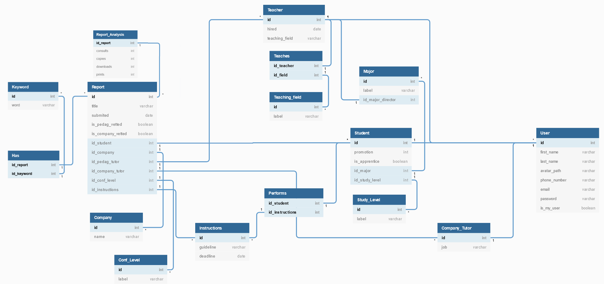

# Mélanie Marques <!-- omit in toc -->
# Louis Prud’homme <!-- omit in toc -->

# Table of contents
- [Table of contents](#table-of-contents)
- [Report description](#report-description)
- [Introduction - short description of project subject](#introduction---short-description-of-project-subject)
- [Naming conventions](#naming-conventions)
  - [Variables](#variables)
  - [Objects](#objects)
  - [Error Management](#error-management)
- [E/R diagram](#er-diagram)
- [Implementation of important issues](#implementation-of-important-issues)
  - [Research](#research)
  - [Check data consistency](#check-data-consistency)
  - [Report statistics :](#report-statistics)
  - [Report :](#report)
  - [Confidentiality :](#confidentiality)
  - [Error management :](#error-management-1)
  - [Search](#search)
  - [Trigger TRG_STUDENT_PROMOTION](#trigger-trgstudentpromotion)
  - [Function FUN_IS_ALLOWED](#function-funisallowed)
  - [Procedures PRC_REPORT_*](#procedures-prcreport)
  - [Function FUN_MOST_WANTED_REPORTS (ne garder que celle-ci ou FUN_REPORTS_BY_KEYWORD ?)](#function-funmostwantedreports-ne-garder-que-celle-ci-ou-funreportsbykeyword)
  - [Function FUN_REPORTS_BY_KEYWORD (ne garder que celle-ci ou FUN_MOST_WANTED_REPORTS ?)](#function-funreportsbykeyword-ne-garder-que-celle-ci-ou-funmostwantedreports)
  - [Trigger TRG_REPORT_VALIDATION](#trigger-trgreportvalidation)
- [Problems encountered](#problems-encountered)
  - [Fucking Oracle](#fucking-oracle)
  - [Oracle = Cancer](#oracle--cancer)
  - [Subject understanding](#subject-understanding)
  - [Virtual machine = de la merde](#virtual-machine--de-la-merde)
  - [Need to commit](#need-to-commit)
- [Conclusion](#conclusion)

# Report description 

> The deliverable consists of separate files; you can add at most three files on Moodle:
> - the report : named name1_name2.pdf
> - the script for populating the database + the script containing the different functions/queries.
> The report must have between 5 and 10 pages. It includes an introduction, a short description of the project subject, some functions/queries for the most important issues of the project, a discussion of the encountered problems/difficulties, and a conclusion. 
> The report should not explain your code in details, let alone include portions of your code: good code should be well self-commented. The code must be properly indented and commented. 
> It must comply with the standard naming rules for variables and functions. 

* [ ] The report must have between 5 and 10 pages.
* [ ] It includes an introduction
* [ ] short description of the project subject
* [ ] some functions/queries for the most important issues of the project
* [ ] a discussion of the encountered problems/difficulties
* [ ] conclusion

# Introduction - short description of project subject

The goal of this project is to develop an electronic document management system to archive all the internship and apprenticeship reports for EFREI.

Today, students must email their reports to tutors (businesses and academics). Apprentice students submit their reports on Moodle. Students can submit intermediate documents but only the final report is saved.

In the solution that we propose, the system allows an easy search of documents, and makes them accessible.
This research can be done by keyword, by category, title, etc. It allows the report to be submitted before a specified deadline. This report only becomes readable for students and teachers after validation by the tutors.
In addition, only people with access to MyEfrei can access the report after validation.

# Naming conventions

## Variables

|       Naming       |         Meaning          |       Example        |
| :----------------: | :----------------------: | :------------------: |
|  Starts with `l`   |      Local variable      |     `ln_id_user`     |
|  Starts with `p`   |    Parameter variable    |     `pn_id_user`     |
| Second char is `n` | Variable of type number  |     `ln_id_user`     |
| Second char is `v` | Variable of type varchar |     `pv_keyword`     |
| Second char is `c` |     Explicit cursor      |     `lc_reports`     |
| Second char is `d` |  Variable of type date   | `ld_deadline_report` |
| Second char is `e` |    Declared exception    | `le_no_record_found` |

## Objects

|      Naming       |    Meaning     |         Example         |
| :---------------: | :------------: | :---------------------: |
| Starts with `tab` |     Table      |      `tab_student`      |
| Starts with `adt` |  Audit table   |      `adt_keyword`      |
| Starts with `rel` | Relation table |     `rel_performs`      |
| Starts with `fun` |    Function    |    `fun_is_allowed`     |
| Starts with `prc` |   Procedure    |  `prc_report_consult`   |
| Starts with `trg` |    Trigger     | `trg_report_validation` |

## Error Management

| Error codes |                              Description                               |
| :---------: | :--------------------------------------------------------------------: |
|   -20002    |               The report is late, the deadline is over.                |
|   -20003    |                The hired date can not be in the future.                |
|   -20004    |                           Keyword not found                            |
|   -20006    |    Inconsistency between the promotion of the student and his group    |
|   -20005    |             Expected at least one keyword for this report.             |
|   -20011    |             Confidentiality settings disable this action.              |
|   -20012    |           The report has not been validated, action aborted.           |
|   -20010    | No records were found for either the report id or student id, or both. |
|   -20013    |                    User must be a user of My Efrei.                    |

# E/R diagram

# Implementation of important issues

## Research 

Easy report search by : 

Keyword
category (internship or apprentices)
Student name
Title
Company Tutor
Pedagogic tutor
Instructions
….

## Check data consistency 

To ensure the consistency of the data, we have undertaken to set up controls at the time of data insertion.

- User emails

Using a CHECK when creating the User table, we verify that the user's email is of the form `example @ example.fr`.

- Phone numbers

Using a CHECK CONSTRAINT on the table User, we verify that the user phone number respect the pattern of a classic phone number : `+33699999999` or `0699999999`.

- Passwords strength

Using a CHECK CONSTRAINT on the table User, we check that the password is strong,  i.e. if it has at least one capital letter, a lowercase letter, a special character, a number and its length is greater than or equal to 8. 

- Teacher hired date not in the future

As the SYSDATE cannot be used in a CHECK CONSTRAINT, we created a trigger : `trg_teacher_hired_date` to ensure that the teacher hired date is lower than the SYSDATE.
If this condition isn't respected, it raises a -20003 APPLICATION ERROR.  

- Each report must have minimum one keyword

We added a trigger `trg_report_validation` in order to check that every final report has at least one keyword. 
Indeed, when a report is declared final, that is to say when it has been vetted by the company tutor and the pedagogic tutor, the trigger count the number of keyword for the report. If this number is lower than 1 it raises a -20005 APPLICATION ERROR. 

- Consistency between a student’s group and their promotion

The trigger `trg_student_promotion` checks if the promotion of the student matches its study level. To achieve this, it gets the current year and month. If the month is before september, we take the previous year as reference. Then we calculate the difference between calculated gratuating year and state graduating year.
If the result is inconsistent, it raises a -20006 APPLICATION ERROR.

## Report statistics : 

Most wanted report
Number of view per report
Most wanted keyword
Number of consultation for each report
Number of copy for each report
Number of printing for each report
Number of downloading for each report

## Report : 

All students have to submit intermediate documents but only the final report will be saved
Submit the report before a deadline
Become readable for the students and teachers only after validation of both tutors

## Confidentiality : 

Implementation of the report confidentiality
When a user wants to download, copy or print a report, check that the action requested are allow by the level of confidentiality.
Only the people who have an access to MyEfrei can have access to the reports after validation

## Error management : 

When searching for a report by keyword, if the keyword does not already exist in the database, send an error message.

## Search 

## Trigger TRG_STUDENT_PROMOTION

## Function FUN_IS_ALLOWED

## Procedures PRC_REPORT_*

## Function FUN_MOST_WANTED_REPORTS (ne garder que celle-ci ou FUN_REPORTS_BY_KEYWORD ?)

## Function FUN_REPORTS_BY_KEYWORD (ne garder que celle-ci ou FUN_MOST_WANTED_REPORTS ?)

## Trigger TRG_REPORT_VALIDATION

# Problems encountered

## Fucking Oracle

## Oracle = Cancer

## Subject understanding

## Virtual machine = de la merde

## Need to commit

# Conclusion